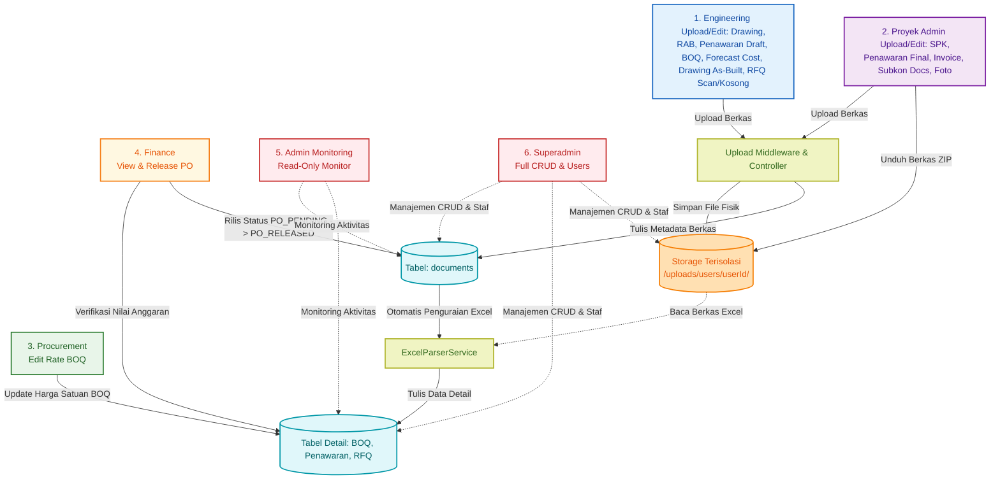

# 🗺️ Flowmap & Spesifikasi Database: Sistem ERP

Dokumen ini mendefinisikan alur kerja kolaborasi proyek, struktur folder penyimpanan file pengguna yang terisolasi, rancangan skema database relasional menggunakan Prisma ORM dan SQL PostgreSQL, serta spesifikasi detail untuk mengimpor data dari file Excel (Penawaran, BOQ, dan RFQ).

---

## 1. Flowmap Alur Kerja Proyek

Berdasarkan alur kerja yang diberikan pada sketsa gambar, berikut adalah visualisasi proses bisnis menggunakan **Mermaid Diagram**:



### 📋 Tabel Rincian Peran & Fungsi Pengguna (Role Matrix)

| Pengguna / Peran (Role) | Hak Akses (Access Control) | Fungsi & Tanggung Jawab Utama |
| :--- | :--- | :--- |
| **Engineering** | CRUD milik sendiri (untuk jenis dokumen tertentu) | - Mengunggah & mengedit berkas Drawing, RAB, Penawaran Draft (Excel), BOQ (Excel), Forecast Cost (Excel), Drawing As-Built, dan RFQ Scan / Kosong.<br>- Melihat berkas SPK, Penawaran Final, Subkon Docs, dan Foto. |
| **Proyek Admin** | CRUD milik sendiri (untuk jenis dokumen tertentu) | - Mengunggah & mengedit berkas SPK, Penawaran Final, Invoice, Subkon Docs, dan Foto.<br>- Melihat & mengunduh berkas Drawing As-Built, RFQ Scan / Kosong, Drawing, dan RAB. |
| **Procurement** | Read + Edit BOQ | - Melihat berkas Penawaran Final, Drawing As-Built, RFQ Scan / Kosong, dan BOQ.<br>- Membuka tab evaluasi dan mengubah kolom harga satuan aktual (`rateProcurement`) di berkas BOQ. |
| **Finance** | Read-Only | - Melihat berkas Penawaran Final, Invoice, Subkon Docs, RFQ Scan / Kosong, RAB, Penawaran Draft, BOQ, dan Forecast Cost.<br>- Melakukan verifikasi dan rilis berkas Purchase Order (PO) / Subkon Docs dari status `PO_PENDING` menjadi `PO_RELEASED`. |
| **Admin (Monitoring)** | Read-Only Global | - Memantau seluruh direktori penyimpanan fisik pengguna.<br>- Memantau seluruh isi tabel transaksi database.<br>- Memantau kronologi log audit sistem global. |
| **Superadmin** | Full CRUD | - Manajemen akun staf (mendaftarkan user baru & mengatur role).<br>- Akses penuh CRUD (Create, Read, Update, Delete) pada seluruh data proyek dan file fisik. |


### Penjelasan Detil Alur Kerja Proyek (Step-by-Step):

1. **Tahap 1 (Unggah File oleh Engineering)**:
   * **Langkah 1**: Staf *Engineering* mengirim berkas Gambar Teknis atau berkas spreadsheet Excel (BOQ, Penawaran, RFQ) melalui form antarmuka web.
   * **Langkah 2**: Server Express menangkap berkas melalui middleware `multer`. Multer mendeteksi uploader ID dan jenis dokumen untuk diletakkan ke folder terisolasi di disk server (`/storage/uploads/users/{user_uuid}/{file_type}/`).
   * **Langkah 3**: Metadata berkas (seperti nama file, path fisik, tipe, ukuran, pengunggah) disimpan ke tabel `documents` dengan status awal `PENDING`.

2. **Tahap 2 (Otomatisasi Parsing Excel ke Database)**:
   * **Langkah 4**: Jika berkas yang diunggah berupa Excel (.xlsx / .xls), sistem memanggil `ExcelParserService`.
   * **Langkah 5a, 5b, 5c**: Layanan pengurai akan membuka lembar kerja Excel dan memindahkan isinya ke dalam baris-baris tabel database secara terstruktur:
     * File **BOQ** dimasukkan ke tabel `boq_headers` dan baris detailnya ke `boq_items`.
     * File **Penawaran** dimasukkan ke tabel `penawaran_headers` dan detail barang ke `penawaran_items` (disertai nama vendor & masa berlaku dari input form modal).
     * File **RFQ** dimasukkan ke tabel `rfq_headers` dan detail penawaran ke `rfq_items`.

3. **Tahap 3 (Pengendalian oleh Proyek Admin)**:
   * Langkah 6: Staf *Proyek Admin* memantau daftar semua berkas proyek melalui tabel Documents Explorer yang mengambil data dari tabel `documents`.
   * Langkah 7: Ketika tombol *Download* ditekan, server memverifikasi sesi lalu menyuplai kembali berkas fisik dari folder terisolasi pengguna bersangkutan agar dapat diunduh ke browser. Proyek Admin juga dapat mengunduh seluruh berkas proyek lapangan sekaligus dalam format ZIP.

4. **Tahap 4 (Evaluasi Harga Satuan oleh Procurement)**:
   * **Langkah 8**: Staf *Procurement* membuka tab evaluasi BOQ untuk melihat rincian item pekerjaan di tabel `boq_items` yang diupload Engineering.
   * **Langkah 9**: Procurement dapat memperbarui kolom `rateProcurement` (harga satuan deal negosiasi) dan menambahkan catatan (*notes*) negosiasi langsung di dalam tabel.
   * **Langkah 10**: Server secara otomatis menghitung ulang `totalPrice` item (`quantity` * `rateProcurement`), mengakumulasi total akhir di tabel `boq_headers` (`totalAmount`), serta mengubah status dokumen menjadi `REVISED_BY_PROCUREMENT`.

5. **Tahap 5 (Verifikasi Keuangan oleh Finance)**:
   * **Langkah 11**: Staf *Finance* dapat melihat dokumen penawaran dalam bentuk popup modal yang berisi data terurai vendor (`penawaran_items` seperti kuantitas, harga, total sub).
   * **Langkah 12**: Finance memonitor total nilai BOQ (`totalAmount` dari `boq_headers`) yang telah disesuaikan oleh Procurement untuk menyinkronkan anggaran pembayaran.

6. **Tahap Pengawasan & Audit Trail (Admin Monitoring & Superadmin)**:
   * Setiap aktivitas penting (seperti unggah berkas, unduh berkas, ubah harga BOQ, hapus berkas) dicatat ke dalam tabel `audit_logs`.
   * **Langkah 13a**: Pengguna ber-role **Admin (Monitoring)** diberikan dashboard khusus untuk memantau data proyek, seluruh berkas, serta tabel audit log secara *Read-Only* (tidak bisa memanipulasi data).
   * **Langkah 13b**: Pengguna ber-role **Superadmin** memiliki akses kontrol mutlak (CRUD) pada semua data proyek, dokumen fisik di server, tabel database, serta penambahan akun pengguna baru.


---

## 2. Struktur Folder Penyimpanan File (User Folder Isolation)

Untuk memenuhi kebutuhan **"setiap user memiliki folder masing-masing"**, penyimpanan fisik berkas di server diisolasi berdasarkan ID unik pengguna (`user_id`). 

Berikut adalah struktur folder penyimpanan pada server/cloud storage (misal di folder `/uploads`):

```text
storage/
└── uploads/
    └── users/
        ├── {user_uuid_1}/               # Folder khusus User 1
        │   ├── gambar/                  # File gambar teknis (.dwg, .pdf, .png)
        │   │   ├── site-plan-v1.pdf
        │   │   └── detail-pondasi.dwg
        │   ├── penawaran/               # Dokumen penawaran vendor (.xlsx, .pdf)
        │   │   ├── penawaran-vendor-a.xlsx
        │   │   └── penawaran-vendor-a.pdf
        │   ├── boq/                     # Dokumen Bill of Quantity (.xlsx)
        │   │   └── boq-initial.xlsx
        │   └── rfq/                     # Dokumen Request for Quotation (.xlsx, .docx)
        │       └── rfq-semen-padang.xlsx
        │
        ├── {user_uuid_2}/               # Folder khusus User 2
        │   ├── gambar/
        │   ├── penawaran/
        │   ├── boq/
        │   └── rfq/
        │
        └── temp_import/                 # Folder sementara untuk parsing Excel
```

> [!IMPORTANT]
> **Kebijakan Keamanan Folder (Security Policy)**:
> 1. Secara fisik, file disimpan dalam direktori terisolasi menggunakan `userId` sebagai nama folder.
> 2. Di level aplikasi (Express.js), middleware autentikasi akan membatasi agar user biasa hanya dapat menulis (`write`) ke dalam folder dengan `userId` mereka sendiri.
> 3. Pengaksesan file oleh role lain (misal Proyek Admin melihat file Engineering) divalidasi melalui endpoint API (seperti `/api/files/download/:fileId`) yang memverifikasi kecocokan hak akses berdasarkan role di database sebelum mengirimkan file (tidak diekspos secara publik/static folder bypass).


## 3. Matriks Hak Akses Pengguna (Role-Based Access Control)

Sistem membedakan izin akses berdasarkan peran masing-masing demi menjaga integritas data keuangan dan dokumen.

| Entitas Data / Fitur | Engineering | Proyek Admin | Procurement | Finance | Admin (Monitoring) | Superadmin |
| :--- | :---: | :---: | :---: | :---: | :---: | :---: |
| **Folder User Sendiri** | CRUD | R | R | R | R | CRUD |
| **Folder User Lain** | - | R (Download) | R (Download) | R (Download) | R | CRUD |
| **Unduh Semua Berkas (ZIP)** | - | R (Download ZIP) | - | - | - | R (Download ZIP) |
| **SPK (Klien)** | R | CRUD | - | - | R | CRUD |
| **Penawaran Final (Klien)** | R | CRUD | R | R | R | CRUD |
| **Drawing As-Built (Klien)** | CRUD | R | R | - | R | CRUD |
| **Invoice (Klien)** | - | CRUD | - | R | R | CRUD |
| **Subkon Docs** | R | CRUD | - | R | R | CRUD |
| **RFQ Scan / Kosong** | CRUD | R | R | R | R | CRUD |
| **Drawing (Internal)** | CRUD | R | - | - | R | CRUD |
| **Foto (Internal)** | R | CRUD | - | - | R | CRUD |
| **RAB (Internal)** | CRUD | R | - | R | R | CRUD |
| **Penawaran Draft** | CRUD | - | - | R | R | CRUD |
| **BOQ** | CRUD | - | RU (Edit Rate) | R | R | CRUD |
| **Forecast Cost** | CRUD | - | - | R | R | CRUD |
| **Manajemen Akun User** | - | - | - | - | - | CRUD |
| **Melihat Log Aktivitas** | - | - | - | - | R (Semua Log) | CRUD |

**Keterangan Simbol:**
* `C` = Create (Tambah Baru)
* `R` = Read / View / Download (Melihat & Mengunduh)
* `U` = Update / Edit (Mengubah Data)
* `D` = Delete (Menghapus Data)
* `-` = Tidak memiliki akses sama sekali

### Perbedaan Utama Level Admin:
1. **Admin (Monitoring)**:
   * **Sifat**: Pasif / Pengawas.
   * **Hak Akses**: Read-only (`R`) pada seluruh log transaksi, data BOQ, penawaran, gambar, dan struktur folder.
   * **Batas Akses**: Tidak memiliki tombol/API endpoint untuk melakukan aksi Edit, Tambah, atau Hapus (`No Write Access`).
2. **Superadmin**:
   * **Sifat**: Aktif / Administrator Utama.
   * **Hak Akses**: Akses penuh (`CRUD`) terhadap database, file fisik, struktur folder user, mengelola akun staff, serta mengubah atau membatalkan data yang salah input oleh staff biasa.
   * **Jejak Audit**: Setiap aksi perubahan yang dilakukan oleh Superadmin wajib tercatat di tabel `audit_logs` untuk menjaga akuntabilitas (menyimpan nilai sebelum vs sesudah perubahan).
